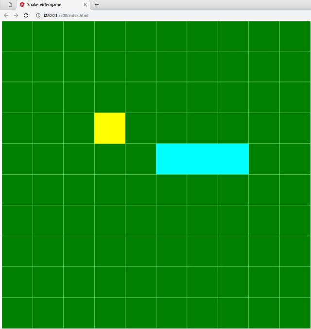
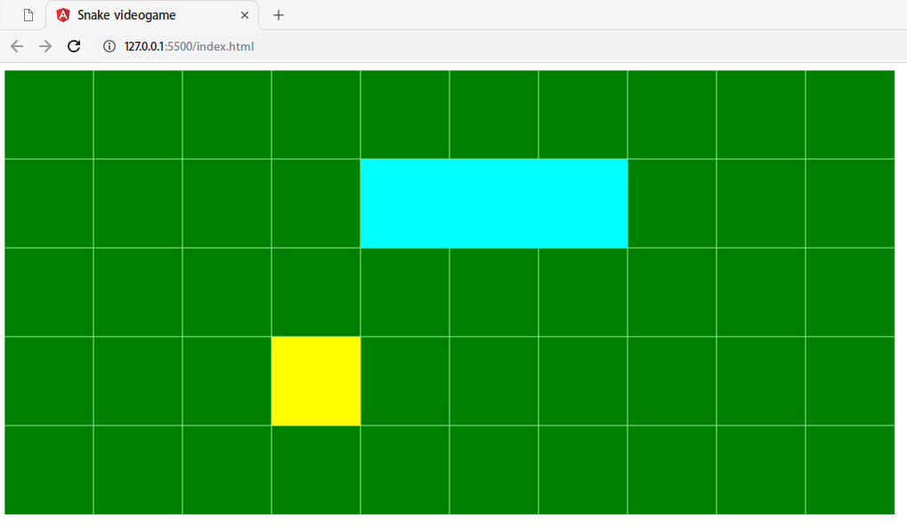
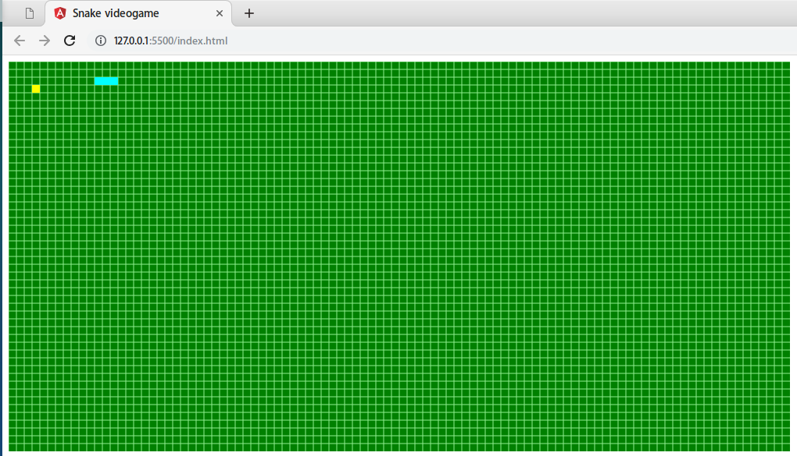

# Snake game for a progress window

I developed this game with the idea of integrating it in a progress dialog, so the user can play to something in order to scape from boredom while he has to wait for a long process to finish.

The game is adaptable, through this line of code that you can check inside `main.ts` file:

```typescript
grid = new Grid(10, 10, 100, 50);
```

The first parameter is the size of the X axis of one tile, the second parámeter is the size of the Y axis. The third and fourth ones controls the width and height in tiles of the whole grid.

Different configurations can produce results like these:

### Big grid


### Wide grid


### Many small tiles


## Usage
If you want to run this game on your machine, you will to run `npm install` and after that, execute:

```
npm run tsc
```
So all the `*.ts` files are compiled and ready. You will need some kind of live server too. The [live server](https://marketplace.visualstudio.com/items?itemName=ritwickdey.LiveServer) extension for VS Code is a good choice.

Feel free to use this game and adapt it to your own needs.
